<div align="center">

<!-- header.svg must be in the root of your ashikthanzeer/ashikthanzeer repo -->


<br/>

<!-- Cycling tagline -->


<br/>

[](https://ashikthanzeer.github.io/portfolio)
[](https://linkedin.com/in/ashikthanzeer)
[](https://github.com/ashikthanzeer)
[](mailto:ashikthanzeer6@outlook.com)
[](https://github.com/ashikthanzeer)

</div>

---

## `$ whoami`

```python
class AshikMuhammedT:
    name      = "Ashik Muhammed T"
    phone     = "+91 98955 26880"
    location  = "Kerala, India 🇮🇳"

    education = {
        "B.Tech CSE"      : {"college": "CET, Trivandrum", "cgpa": 9.42, "since": "Aug 2025"},
        "BS Data Science" : {"college": "IIT Madras",      "cgpa": 8.83, "since": "Sep 2025"},
    }

    interests = [
        "Web Development",
        "Data Science & Applications",
        "Problem Solving",
        "Open Source",
    ]

    currently = "Learning, building, and figuring things out one bug at a time 🐛"
```

---

## `$ ls ./tech_stack/`

<div align="center">

**Languages**


**Web & Database**


**Tools & Environment**


**Core CS Concepts**


</div>

---

## `$ git log --oneline ./projects/`

<details>
<summary><b>📌 StudyPlanner &nbsp;·&nbsp; <code>React · Vite · TypeScript · Express.js · PostgreSQL</code></b></summary>
<br/>

```
commit a3f9c21  feat: student productivity platform
├── ✅ Pomodoro timer with custom session lengths
├── ✅ Streak tracking & deadline reminders
├── ✅ Notification support
└── ✅ Web + Android apps connected to shared backend database
```

> 🎯 A comprehensive platform for task management, study planning, and progress tracking.

</details>

<details>
<summary><b>📌 ScoreFusion &nbsp;·&nbsp; <code>HTML · CSS · JavaScript</code></b></summary>
<br/>

```
commit b7d2e84  feat: JEE Main & KEAM score calculator
├── ✅ Computes marks directly from response sheets
├── ✅ Automated score calculation & result analysis
└── ✅ Intuitive UI for uploading data and viewing scores
```

> 🎯 Reduces manual effort in score checking for JEE Main and KEAM candidates.

</details>

<details>
<summary><b>📌 Expense Tracker &nbsp;·&nbsp; <code>HTML · CSS · JavaScript</code></b></summary>
<br/>

```
commit c1a5f63  feat: personal & group expense manager
├── ✅ Trip expense sharing & auto bill-splitting
├── ✅ Dashboards for monitoring spending patterns
└── ✅ Multi-participant group expense management
```

> 🎯 Makes splitting bills and tracking shared expenses effortless.

</details>

---

## `$ cat achievements.log`

<div align="center">

| 🏆 Exam | 📊 Score / Rank |
|:--------|:---------------|
| AISSCE 2025 | **487 / 500 — 97.4%** |
| JEE Main 2025 | **96.815 Percentile** |
| JEE Advanced 2025 | **OBC-NCL Rank 8078** |
| KEAM 2025 | **Rank 433** |
| CUSAT CAT 2025 | **Rank 335** |

</div>

---

## `$ htop --user=ashikthanzeer`

<div align="center">


</div>

---

## `$ ping ashik.dev`

<div align="center">

```
PING ashik.dev (ashikthanzeer6@outlook.com) — ttl=∞

> Open to internships & collaborations
> Interested in web dev and data science projects
> Still learning, always curious
> Response time: < 24 hours ⚡

4 packets transmitted | 4 received | 0% packet loss
```

<br/>


<br/>


</div>
